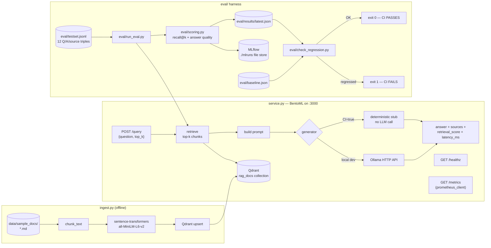

# rag-mlops-pipeline

A Retrieval-Augmented Generation service built with **production MLOps discipline**,
not just a chatbot demo. Qdrant for retrieval, a local open-weight LLM via Ollama for
generation, BentoML to serve it, MLflow to track every eval run, and a GitHub Actions
CI pipeline that **fails the build if retrieval or answer quality regresses**.

Generic "ask questions about my PDF" RAG demos are extremely oversaturated right now.
The differentiator here isn't the RAG chatbot itself — it's the **regression-gated eval
harness wrapped around it**, which is the part most public RAG repos skip entirely.

## Why this exists (the differentiator)

Most public RAG demos have **zero evaluation**. They show a chatbot answering a few
cherry-picked questions well and stop there. There is no way to know if a prompt
change, a chunking change, or a dependency bump quietly made retrieval or answers
worse — because nothing measures it, let alone gates on it.

This repo's CI pipeline (`.github/workflows/eval.yml`) runs a real eval suite on
**every pull request** and **fails the build** if either of these drops more than 2
percentage points below the stored baseline (`eval/baseline.json`):

- **Retrieval recall@k** — did the chunk that actually answers the question show up
  in the top-k retrieved results?
- **Answer-quality score** — does the generated answer contain the key phrases a
  correct answer must contain?

That's the whole point: **a quality regression should be as loud and as blocking as a
failing unit test.**

## Architecture



**Flow in words:**
1. `ingest.py` chunks the sample doc corpus, embeds chunks locally, upserts into Qdrant.
2. `service.py` (BentoML, port 3000) retrieves top-k chunks from Qdrant for a question,
   builds a prompt, generates an answer (Ollama locally, or a deterministic stub in CI),
   and returns a structured response while emitting Prometheus metrics.
3. `eval/run_eval.py` runs the same retrieval pipeline against every question in
   `eval/testset.jsonl`, scores it, and logs params/metrics to MLflow.
4. `eval/check_regression.py` compares that run against `eval/baseline.json` and exits
   non-zero on regression — this is the command CI calls to gate the build.

## What CI validates vs. what requires local Ollama

Being explicit about this matters more than pretending CI does everything.

| Capability | Validated in CI (`eval.yml`) | Requires local Ollama |
|---|---|---|
| Document chunking + embedding (`sentence-transformers`) | ✅ real | — |
| Qdrant ingestion + retrieval (`ingest.py`, live Qdrant service container) | ✅ real | — |
| Retrieval recall@k scoring | ✅ real | — |
| Answer-quality scoring (key-phrase match) | ✅ real, but against **stub-generated** answers | For real LLM-generated answers, run locally |
| Regression gate (`check_regression.py`) | ✅ real | — |
| `/healthz`, `/metrics` endpoints | ✅ real (unit-testable without Qdrant) | — |
| `/query` end-to-end with a real LLM | ❌ not in CI | ✅ `ollama serve` + `ollama pull llama3.2`, then run `service.py` locally or via `docker compose` |
| Docker image build / `docker-compose` stack | ❌ not exercised by `eval.yml` | ✅ `docker compose up -d --build` |

GitHub-hosted runners have no GPU and no pre-pulled multi-gigabyte model, so having CI
call a real local LLM would be slow and flaky — exactly the kind of eval nobody trusts
enough to actually gate on. Instead, CI sets `CI=true`, which switches
`rag_core.answer_question()` to a small, deterministic, dependency-free **stub
generator** (`rag_core.generate_stub`) that template-joins the retrieved chunk text
instead of calling an LLM. This keeps the regression gate fast, deterministic, and
still exercises the *real* retrieval pipeline end-to-end against a *real* Qdrant
instance — it just doesn't exercise real LLM generation quality.

**Extension point (not in the CI gate on purpose):** an LLM-as-judge answer-quality
metric (e.g., asking a model to grade faithfulness/relevance) is a natural next step
for *local* evaluation, but is deliberately kept out of `eval/scoring.py` and the CI
gate — an external API call in a hard CI gate is slow, costs money per run, and is
non-deterministic, which is the opposite of what a regression gate needs. If you add
one, keep it as a separate, non-blocking `eval/llm_judge.py` script.

## Interface contract

| | |
|---|---|
| Service | BentoML, listens on port `3000` |
| `GET /healthz` | `200 {"status": "ok", ...}` |
| `GET /metrics` | Prometheus text exposition format |
| `POST /query` | body `{"question": str, "top_k": int = 5}` → `{"answer": str, "sources": [...], "retrieval_score": float, "latency_ms": float}` |

### Environment variables

| Variable | Default | Purpose |
|---|---|---|
| `QDRANT_URL` | `http://localhost:6333` | Qdrant endpoint |
| `QDRANT_COLLECTION` | `rag_docs` | Qdrant collection name |
| `OLLAMA_HOST` | `http://localhost:11434` | Ollama HTTP API base URL |
| `OLLAMA_MODEL` | `llama3.2` | Ollama model tag to generate with |
| `MLFLOW_TRACKING_URI` | `./mlruns` (filesystem) | MLflow tracking store — no separate MLflow server required |
| `CI` | unset | Set to `true` to force the deterministic stub generator instead of Ollama |
| `GENERATOR` | unset | Explicit override: `stub` or `ollama` (takes precedence over `CI`) |

### Prometheus metrics (`GET /metrics`)

| Metric | Type | Labels | Meaning |
|---|---|---|---|
| `rag_requests_total` | Counter | `status` (`ok`/`error`) | Total `/query` requests |
| `rag_request_latency_seconds` | Histogram | — | End-to-end `/query` latency |
| `rag_retrieval_score` | Histogram | — | Top-1 retrieval cosine similarity per query |
| `rag_tokens_generated_total` | Counter | — | Total tokens generated across all responses |

## Quickstart

```bash
# 1. Start Qdrant + the RAG service
docker compose up -d --build

# 2. Run Ollama on the host (not containerized — see docker-compose.yml comments)
ollama serve &
ollama pull llama3.2

# 3. Ingest the sample corpus into Qdrant
docker compose exec rag-service python ingest.py
# (or, running the service locally instead of in Docker: python ingest.py)

# 4. Query it
curl -s localhost:3000/healthz
curl -s localhost:3000/query \
  -X POST -H 'content-type: application/json' \
  -d '{"question": "What command creates a Python virtual environment?", "top_k": 3}' | python3 -m json.tool
```

### Running the service without Docker

```bash
python3 -m venv .venv && source .venv/bin/activate
pip install -r requirements.txt

# Qdrant needs to be running somewhere reachable at QDRANT_URL, e.g.:
docker run -p 6333:6333 qdrant/qdrant

python ingest.py
bentoml serve service:svc   # binds 0.0.0.0:3000
```

## Running the eval suite locally

```bash
# Needs a live Qdrant with the corpus already ingested (see Quickstart).
# Uses the stub generator unless Ollama is running and GENERATOR=ollama is set.
python eval/run_eval.py --top-k 5
python eval/check_regression.py

# To exercise real Ollama-generated answers in the eval suite instead of the stub:
ollama serve &
GENERATOR=ollama python eval/run_eval.py --top-k 5
```

`run_eval.py` writes per-run metrics to `eval/results/latest.json` and logs
params/metrics (and the full per-question breakdown as an artifact) to MLflow under
the `rag-eval` experiment. View it with:

```bash
mlflow ui --backend-store-uri ./mlruns
# open http://localhost:5000
```

### Moving the baseline forward

After a verified, intentional quality improvement:

```bash
python eval/run_eval.py --top-k 5
# review eval/results/latest.json, then:
cp eval/results/latest.json eval/baseline.json   # keep the file's _comment field
git add eval/baseline.json
git commit -m "eval: raise baseline after retrieval improvement"
```

`check_regression.py` deliberately fails closed: if either `eval/baseline.json` or a
fresh eval run is missing a gated metric, that counts as a failure, not a pass.

## Repo layout

```
data/sample_docs/       6 real markdown docs — a "Python Packaging & Release FAQ"
                         corpus (pyproject.toml, venvs, dependency pinning, wheels vs
                         sdists, publishing to PyPI, entry points)
ingest.py                chunk -> embed -> upsert into Qdrant
rag_core.py               shared retrieve/prompt/generate pipeline (service.py + eval/)
service.py                BentoML service: /healthz, /metrics, /query
eval/
  testset.jsonl            12 question/expected-answer/expected-source triples
  scoring.py                pure retrieval-hit / answer-quality / aggregate functions
  regression.py             pure baseline-comparison logic
  run_eval.py                runs testset.jsonl end-to-end, logs to MLflow
  check_regression.py        CI gate CLI — exits non-zero on regression
  baseline.json               stored known-good metrics
tests/                      pytest unit tests for scoring.py + regression.py
.github/workflows/eval.yml   CI: spins up Qdrant, ingests, evals, gates, tests
docker-compose.yml           qdrant + rag-service (Ollama runs on the host)
Dockerfile                   builds the BentoML service image
```

## Known limitations

- `rag_retrieval_score`/other Prometheus metrics use the default in-process
  `CollectorRegistry`, which is correct for the single-process `bentoml serve` default
  used here. A multi-worker deployment would need `prometheus_client`'s multiprocess
  mode (a documented, standard extension, not implemented here to keep the demo
  focused).
- Chunking is word-based with fixed windows (120 words, 30-word overlap) rather than
  sentence- or token-aware — simple and dependency-free, but it means a fact that sits
  exactly on a chunk boundary can occasionally be split across two chunks. This is
  visible in the real baseline: `answer_quality_avg` is `0.9583`, not a suspicious
  `1.0`, because one eval question's two expected key phrases land in different
  chunks under `top_k=5`. That's a genuine, unfixed retrieval-granularity artifact,
  not a bug — left as-is rather than hand-tuned to hit a clean number.

## Part of a small AI-infrastructure project set

This repo is one piece of a set of small, focused AI-infra portfolio projects:
`ai-agent-guardrails`, `llm-observability-stack`, `ai-infra-terraform`, and this one
(`rag-mlops-pipeline`). Each is meant to demonstrate one slice of production AI
infrastructure discipline rather than one big monolithic demo.

## License

MIT — see [LICENSE](LICENSE).
